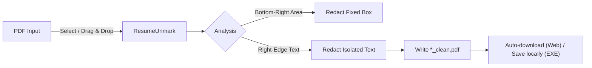

# ResumeUnmark

Remove bottom-right watermarks and isolated right-edge text from PDFs — locally, fast, and privacy-first.

**ResumeUnmark** provides two powerful ways to clean your documents:

1.  **Desktop App**: Drag & Drop batch processing for files and folders (Windows `.exe`).
2.  **Web Interface**: A browser-based tool for quick, single-file cleaning (GitHub Pages).

**Live Web UI:** [https://patrickzs.github.io/ResumeUnmark/](https://patrickzs.github.io/ResumeUnmark/)

> **Privacy Note:** All processing happens locally on your machine (whether using the Desktop App or the Web UI). Your files are never uploaded to any server.

---

## Introduction

Many resume builders and document sites add small logos, links, or copyright text near the **bottom-right corner** or along the **right margin**. ResumeUnmark removes these distractions to give you a clean, professional PDF.

It uses two methods:

1.  **Universal Bottom-Right Cleaning**: Removes everything in a fixed bottom-right area (e.g., standard site logos).
2.  **Smart Right-Edge Detection**: Identifies and removes small, isolated text blocks in the right margin that sit below the main body content (e.g., "© site.com").



---

## Key Features

- **Dual Cleaning Mode**:
  - **Fixed Area**: Automatically whitens out the bottom-right corner.
  - **Smart Heuristic**: Detects small text blocks on the right half of the page that are _below_ the main body content (robust against resizing or shifting content).
- **Batch Processing (Desktop App)**: Drag multiple PDFs or entire folders onto the application to clean them all at once.
- **Recursive Folder Support**: When dropping a folder, it finds and processes all `.pdf` files inside.
- **Safe Output**: Creates a new file ending in `_clean.pdf`, leaving your original file untouched.
- **Zero Configuration**: Works out of the box for most common resume watermarks.

---

## Installation & Usage

### Option A: Windows Desktop App (Recommended for Batch)

1.  **Download**: Go to [Releases](../../releases) and download `ResumeUnmark.exe`.
2.  **Run**: Place it anywhere (Desktop/Documents).
3.  **Use**:
    - **Drag & Drop**: Drag PDF files or folders directly onto `ResumeUnmark.exe`.
    - **Check Output**: Cleaned files (`*_clean.pdf`) will appear in the same folder as the originals.

### Option B: Web UI (No Install)

1.  **Open**: Navigate to the [Live Web UI](https://patrickzs.github.io/ResumeUnmark/).
2.  **Upload**: Drag & drop your PDF into the drop zone.
3.  **Clean**: Click **Clean & Download**.
4.  **Save**: The cleaned file is downloaded by your browser.

_Note: The Web UI is perfect for one-off tasks on any device._

### Option C: Run from Source (Python)

If you prefer running the raw script or want to modify the code:

1.  **Prerequisites**: Python 3.9+
2.  **Install Dependencies**:
    ```bash
    pip install pymupdf
    ```
3.  **Run**:
    ```bash
    python ResumeUnmark.py "path/to/your/file.pdf"
    ```
    _Or drag files onto the script if you have Python file associations set up._

---

## Building the Executable

To build the standalone `.exe` yourself:

1.  Install PyInstaller:
    ```bash
    pip install pyinstaller
    ```
2.  Run the build command:
    ```bash
    pyinstaller --onefile --name "ResumeUnmark" ResumeUnmark.py
    ```
3.  Find your executable in the `dist/` folder.

---

## How It Works (The Heuristic)

The "Smart Right-Edge Detection" algorithm follows these rules to identify watermarks without accidentally deleting your resume content:

1.  **Define Body Content**: Scans for text blocks that start on the **left half** of the page (x < 50%). The lowest point of this text defines the "Body Bottom".
2.  **Identify Candidates**: Looks for text blocks on the **right half** (x >= 50%).
3.  **Filter**: A block is considered a watermark if:
    - It is **below** the "Body Bottom".
    - It is **small** (short character count).
    - It is **isolated** from other content.

This ensures that sidebars or right-aligned headers are preserved, while footer-style watermarks are removed.

---

## Contribution Guidelines

Contributions are welcome — especially improvements to watermark detection heuristics and UI polish.

### How to contribute

1.  Fork the repo and create a feature branch.
2.  Keep changes focused and easy to review.
3.  Update documentation for user-visible behavior changes.
4.  Open a Pull Request with:
    - what changed
    - why it changed
    - a before/after note (screenshots for UI changes help)

### Development notes

- Web UI lives in `docs/` (static hosting compatible).
- Desktop logic lives in `ResumeUnmark.py` (PyMuPDF).
- Prefer local-first approaches; avoid introducing server-side processing.

---

## License

MIT. See `LICENSE` if present, otherwise treat this project as MIT-licensed per repository intent.
