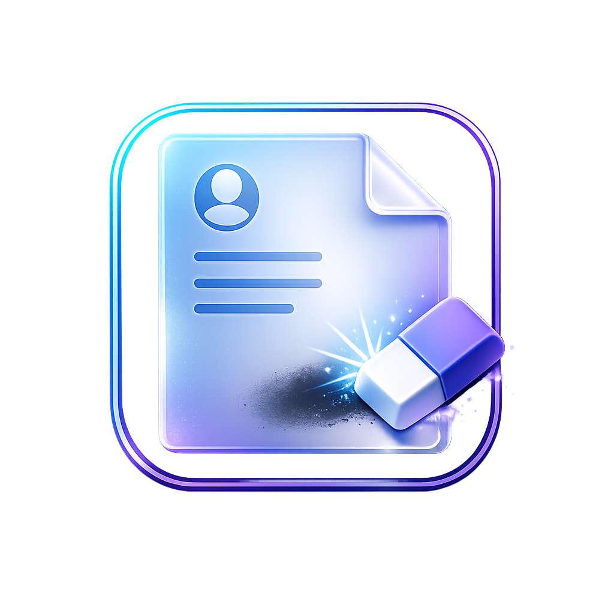
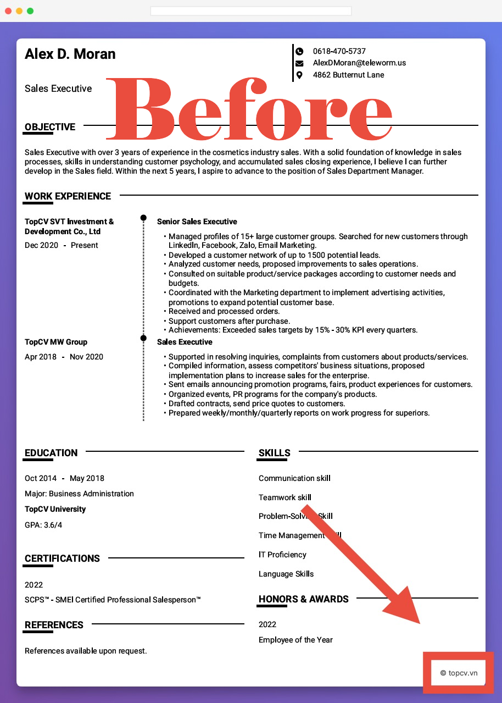
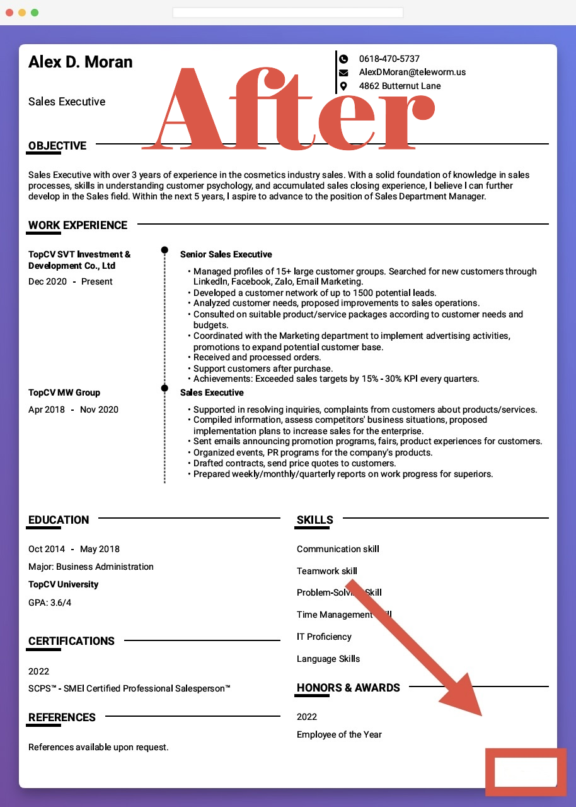

<div align="center">



# ResumeUnmark

**Remove bottom-right watermarks and isolated right-edge text from PDFs — locally, fast, and privacy-first.**

[](https://github.com/patrickzs/ResumeUnmark/releases)
[](LICENSE)
[](#-installation--prerequisites)

[Features](#-key-features) •
[Folder Structure](#-folder-structure) •
[Installation](#-installation--prerequisites) •
[How to Use](#-how-to-use) •
[Roadmap](#-roadmap) •
[Contributing](#-contribution-guidelines)

</div>

---

## 💡 Introduction

Many resume builders and document sites add tiny logos, links, or copyright text in the **bottom-right corner** or along the **right margin** of exported PDFs. That content can look unprofessional and distract from the actual resume.

### The solution

ResumeUnmark removes these artifacts using **PDF redaction**:

- 🧱 **Fixed bottom-right redaction**: reliably clears a configurable corner region (great for consistent “site logo” watermarks).
- 🧠 **Smart right-edge detection**: detects small, isolated text blocks on the right side _below the body content_ (great for “© site.com” style marks).

### Why use this tool?

- 🔒 **Privacy-first**: everything runs locally (desktop and web UI).
- ⚡ **Fast**: page-level redaction + optimized save settings.

---

## 🚀 Key Features

- 🧼 **Dual-mode cleaning**
  - **Corner box**: deterministic removal for predictable watermarks
  - **Edge heuristic**: adaptive removal for shifting watermark positions
- 🧾 **Safe outputs**: writes a new `*_clean.pdf` file; the original remains untouched.
- 🛠 **Tunable defaults**: detection/removal constants live in `src/core/config.py`.

### Without vs. With ResumeUnmark

|                         | Without          | With           |
| ----------------------- | ---------------- | -------------- |
| Footer / edge watermark | ❌ Still visible | ✅ Redacted    |
| Batch folders           | ❌ Manual        | ✅ Drag & drop |
| Privacy                 | ⚠️ Depends       | ✅ Local-only  |

### Visual Comparison

|      Original (Watermarked)       |       Cleaned (Processed)       |
| :-------------------------------: | :-----------------------------: |
|  |  |

---

## 🧰 Installation & Prerequisites

### Option A — Web UI (No install)

- Live Web UI: https://patrickzs.github.io/ResumeUnmark/

### Option B — Run from source (Python)

**Prereqs**

- Python **3.9+**

**Clone + install**

```bash
git clone https://github.com/patrickzs/ResumeUnmark.git
cd ResumeUnmark
pip install -r requirements.txt
```

---

## 📖 How to Use

### 1. Web Version (No Installation Required)

The easiest way to use ResumeUnmark is via the web interface. It runs entirely in your browser—no files are uploaded to any server.

1. Go to **[ResumeUnmark Web](https://patruxs.github.io/ResumeUnmark/)**.
2. **Drag & Drop** your PDF (or click "Choose file").
3. Click **Clean & Download**.
4. Save your new `_clean.pdf` file!

### 2. CLI (Python Source)

For developers or batch automation, run directly from source.

**Setup**:
Ensure you have installed the dependencies:

```bash
pip install -r requirements.txt
```

**Single File**:

```bash
python -m src.cli.main "path/to/my_resume.pdf"
```

_Output: `path/to/my_resume_clean.pdf`_

**Batch Processing (Folder)**:
Clean every PDF in a folder automatically:

```bash
python -m src.cli.main "path/to/folder_with_pdfs"
```

### 3. Local Web Server (Development)

To run the web interface locally:

1. Start the server:
   ```bash
   python -m http.server 8000
   ```
2. Open your browser to: `http://localhost:8000/docs/`

---

## 🗂 Folder Structure

```text
ResumeUnmark/
├── .github/workflows/         # CI/CD (tests + exe build)
├── docs/                      # Web UI (GitHub Pages)
├── scripts/                   # Automation (build script)
├── src/                       # Desktop app (Python)
│   ├── cli/                   # CLI entry point (drag & drop / args)
│   ├── core/                  # Cleaner + detection logic
│   └── utils/                 # File discovery + path helpers
├── tests/                     # Unit tests
├── ResumeUnmark.spec           # PyInstaller spec
├── requirements.txt            # Runtime deps
└── requirements-dev.txt        # Dev + build deps (pytest/black/flake8/mypy/pyinstaller)
```

---

## 🗺 Roadmap

Project status: **beta**.

- [x] Fixed bottom-right corner removal
- [x] Right-edge watermark detection
- [x] Batch folder support (drag & drop)
- [x] Web UI (GitHub Pages)
- [x] CI tests on Windows/macOS/Linux
- [x] CI build for `ResumeUnmark.exe` + artifact upload
- [ ] Add user-configurable profiles (conservative/aggressive)
- [ ] Add a small GUI toggle for edge detection vs. corner-only
- [ ] Improve packaging metadata / console script entrypoint

---

## 🤝 Contribution Guidelines

### Standard Git workflow

1. Fork the repo
2. Create a branch: `git checkout -b feat/my-change`
3. Commit: `git commit -m "feat: ..."`
4. Push: `git push origin feat/my-change`
5. Open a Pull Request

### Local checks (recommended before PR)

```bash
pip install -r requirements-dev.txt
pytest -v
black --check src/ tests/
flake8 src/ tests/ --max-line-length=100
mypy src/
```

---

## 📜 License, Disclaimers, & Acknowledgments

### License

MIT — see `LICENSE`.

### Disclaimers

- ResumeUnmark is not affiliated with any resume builder or watermarking service.
- Redaction is destructive by design (it removes content in targeted regions). Always review outputs before sharing.

### Acknowledgments

- **PyMuPDF** (`pymupdf` / `fitz`) for PDF parsing and redaction
- **PyInstaller** for Windows executable packaging
- **pdf-lib** and **pdf.js** for browser-based PDF manipulation in the Web UI
