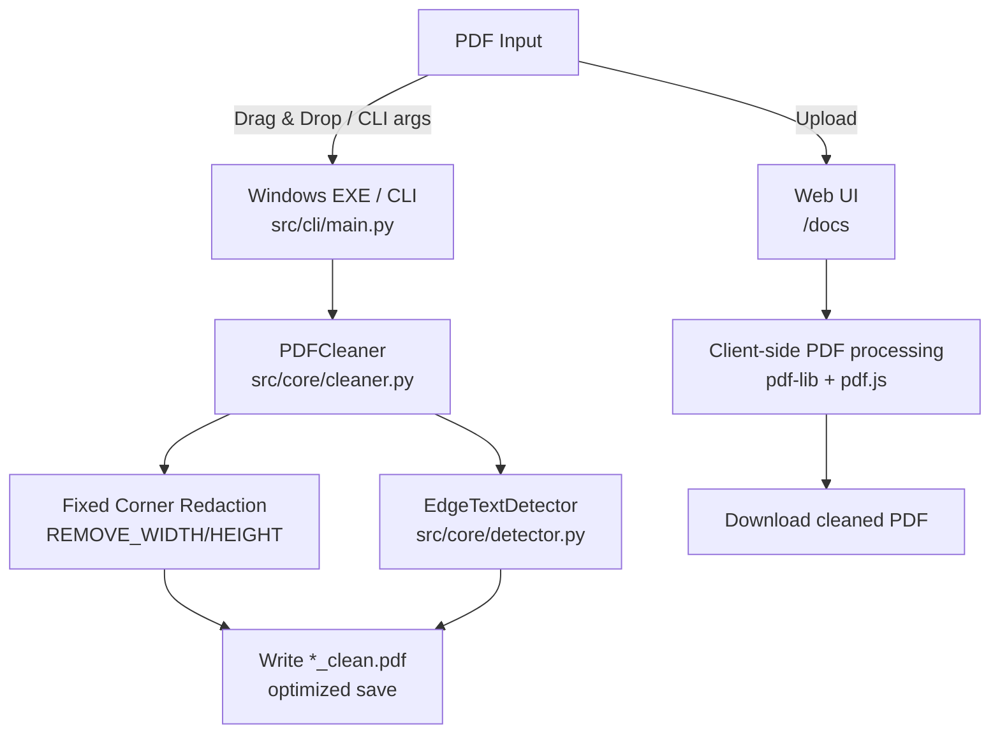

<div align="center">

# ResumeUnmark

**Remove bottom-right watermarks and isolated right-edge text from PDFs — locally, fast, and privacy-first.**

[](https://github.com/patrickzs/ResumeUnmark/releases)
[](LICENSE)
[](#-installation--prerequisites)
[](https://github.com/patrickzs/ResumeUnmark/actions/workflows/tests.yml)
[](https://github.com/patrickzs/ResumeUnmark/actions/workflows/build.yml)

[Features](#-key-features) •
[Architecture](#-overall-architecture) •
[Installation](#-installation--prerequisites) •
[Usage](#-running-the-project-usage) •
[Roadmap](#-roadmap) •
[Contributing](#-contribution-guidelines)

</div>

---

## 💡 Introduction

### The hook

Many resume builders and document sites add tiny logos, links, or copyright text in the **bottom-right corner** or along the **right margin** of exported PDFs. That content can look unprofessional and distract from the actual resume.

### The solution

ResumeUnmark removes these artifacts using **PDF redaction**:

- 🧱 **Fixed bottom-right redaction**: reliably clears a configurable corner region (great for consistent “site logo” watermarks).
- 🧠 **Smart right-edge detection**: detects small, isolated text blocks on the right side _below the body content_ (great for “© site.com” style marks).

### Why use this tool?

- 🔒 **Privacy-first**: everything runs locally (desktop and web UI).
- ⚡ **Fast**: page-level redaction + optimized save settings.
- 🧰 **Two interfaces**: Windows `.exe` for batch work + browser-based Web UI for quick edits.
- 🧪 **CI-backed**: tests and builds run on GitHub Actions.

---

## 🚀 Key Features

- 🧼 **Dual-mode cleaning**
  - **Corner box**: deterministic removal for predictable watermarks
  - **Edge heuristic**: adaptive removal for shifting watermark positions
- 📦 **Batch processing (Windows EXE)**: drag & drop files _or folders_; processes PDFs recursively.
- 🧾 **Safe outputs**: writes a new `*_clean.pdf` file; the original remains untouched.
- 🛠 **Tunable defaults**: detection/removal constants live in `src/core/config.py`.

### Without vs. With ResumeUnmark

|                         | Without          | With           |
| ----------------------- | ---------------- | -------------- |
| Footer / edge watermark | ❌ Still visible | ✅ Redacted    |
| Batch folders           | ❌ Manual        | ✅ Drag & drop |
| Privacy                 | ⚠️ Depends       | ✅ Local-only  |

> 🖼️ **Screenshots placeholder:** Add `docs/assets/before.png` and `docs/assets/after.png` and link them here.

---

## 🧱 Overall Architecture

ResumeUnmark ships as **two independent frontends**:

- 🐍 **Desktop pipeline (Python + PyMuPDF)** — best for batch cleaning and folders.
- 🌐 **Web pipeline (static Web UI in `docs/`)** — best for a quick single-file clean in the browser.



### Tech stack & core dependencies

- **Desktop**: Python 3.9+ + **PyMuPDF** (`pymupdf` / `fitz`)
- **Packaging**: **PyInstaller** (`ResumeUnmark.spec`, `scripts/build.py`)
- **Web UI**: static assets in `docs/` (served by GitHub Pages)
- **CI/CD**: GitHub Actions (`.github/workflows/tests.yml`, `.github/workflows/build.yml`)

---

## 🧰 Installation & Prerequisites

### Option A — Web UI (No install)

- Live Web UI: https://patrickzs.github.io/ResumeUnmark/

### Option B — Run from source (Python)

**Prereqs**

- Python **3.9+**

**Clone + install**

```bash
git clone https://github.com/patrickzs/ResumeUnmark.git
cd ResumeUnmark
pip install -r requirements.txt
```

---

## 🔧 Environment Configuration

No `.env` is required.

```dotenv
# ResumeUnmark does not require environment variables.
```

---

## ▶️ Running the Project (Usage)

### CLI (from source)

Run on one or more paths (files or folders):

```bash
python -m src.cli.main "path/to/file-or-folder"
```

Example output:

```text
[SUCCESS] Cleaned: input.pdf -> input_clean.pdf
```

### Web UI (local development)

Serve the repo root and open the `/docs/` path:

```bash
python -m http.server 8000
```

Then open:

- `http://localhost:8000/docs/`

---

## 🏗️ Build & Release

### Build the Windows EXE locally (PyInstaller)

```bash
pip install -r requirements-dev.txt
python scripts/build.py
```

Outputs:

- `dist/ResumeUnmark.exe`

---

## 🗂 Folder Structure

```text
ResumeUnmark/
├── .github/workflows/         # CI/CD (tests + exe build)
├── docs/                      # Web UI (GitHub Pages)
├── scripts/                   # Automation (build script)
├── src/                       # Desktop app (Python)
│   ├── cli/                   # CLI entry point (drag & drop / args)
│   ├── core/                  # Cleaner + detection logic
│   └── utils/                 # File discovery + path helpers
├── tests/                     # Unit tests
├── ResumeUnmark.spec           # PyInstaller spec
├── requirements.txt            # Runtime deps
└── requirements-dev.txt        # Dev + build deps (pytest/black/flake8/mypy/pyinstaller)
```

---

## 🗺 Roadmap

Project status: **beta**.

- [x] Fixed bottom-right corner removal
- [x] Right-edge watermark detection
- [x] Batch folder support (drag & drop)
- [x] Web UI (GitHub Pages)
- [x] CI tests on Windows/macOS/Linux
- [x] CI build for `ResumeUnmark.exe` + artifact upload
- [ ] Add user-configurable profiles (conservative/aggressive)
- [ ] Add a small GUI toggle for edge detection vs. corner-only
- [ ] Improve packaging metadata / console script entrypoint

---

## 🤝 Contribution Guidelines

### Standard Git workflow

1. Fork the repo
2. Create a branch: `git checkout -b feat/my-change`
3. Commit: `git commit -m "feat: ..."`
4. Push: `git push origin feat/my-change`
5. Open a Pull Request

### Local checks (recommended before PR)

```bash
pip install -r requirements-dev.txt
pytest -v
black --check src/ tests/
flake8 src/ tests/ --max-line-length=100
mypy src/
```

---

## 📜 License, Disclaimers, & Acknowledgments

### License

MIT — see `LICENSE`.

### Disclaimers

- ResumeUnmark is not affiliated with any resume builder or watermarking service.
- Redaction is destructive by design (it removes content in targeted regions). Always review outputs before sharing.

### Acknowledgments

- **PyMuPDF** (`pymupdf` / `fitz`) for PDF parsing and redaction
- **PyInstaller** for Windows executable packaging
- **pdf-lib** and **pdf.js** for browser-based PDF manipulation in the Web UI
- GitHub Actions for CI/CD
