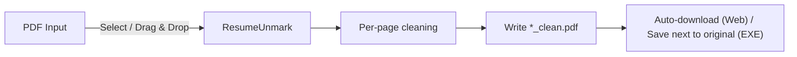

# ResumeUnmark

Remove bottom-right watermarks from PDFs — locally, fast, and privacy-first.

ResumeUnmark provides:
- A **Windows drag-and-drop app** (`ResumeUnmark.exe`) for batch processing files/folders.
- A **static Web UI** (GitHub Pages) for “open site → drop PDF → download cleaned PDF” workflows.

> Privacy by design: ResumeUnmark runs locally (desktop) or locally in your browser (web). No server uploads.

---

## Introduction

Many resume builders and document sites add small logos, links, or copyright text near the **bottom-right corner**. ResumeUnmark removes those marks by drawing a white rectangle over a configurable bottom-right region on each page.

Optionally, the Web UI can also remove **small, isolated right-edge text** using a heuristic (useful for “© site.com” style marks in whitespace).



---

## Key Features

- **Universal bottom-right cleaning**: removes text/images in a fixed bottom-right area (does not rely on matching watermark text).
- **Batch support (EXE)**: drag folders or multiple PDFs onto the executable.
- **One-click workflow (Web UI)**: drag/select a PDF, then **Clean & Download**.
- **Optional right-edge text cleanup (Web UI)**: experimental heuristic for small watermark text in right-side whitespace.
- **Predictable output**: writes a file ending with `_clean.pdf`.

---

## Installation

### Option A: Windows `.exe` (recommended)

1. Go to **Releases**.
2. Download `ResumeUnmark.exe`.
3. Place it anywhere (Desktop/Documents).

### Option B: Web UI (GitHub Pages)

The web UI is a static site in `docs/`.

1. Push this repo to GitHub.
2. GitHub → **Settings → Pages**
3. **Deploy from a branch** → choose branch (`main`/`master`) + folder `/docs`
4. Open the published URL.

Notes:
- Processing happens locally in the browser (no uploads).
- The selected file name + size appears inside the drop area.
- If your resume has content near the far-right margin (e.g., a right sidebar), disable the experimental right-edge text option.

---

## Running the Project

### Web UI (local preview)

From the repo root (the folder containing `ResumeUnmark/`), run:

```bash
cd ResumeUnmark
python -m http.server 8000
```

Open:
- `http://localhost:8000/docs/`

### Web UI (usage)

1. Open the site.
2. Drag & drop a PDF (or click **Choose file**).
3. Click **Clean & Download**.
4. Your browser downloads `*_clean.pdf` automatically.

### Windows `.exe` (usage)

**Drag & drop**
1. Drag one or more PDFs (or a folder) onto `ResumeUnmark.exe`.
2. Cleaned PDFs are created next to the originals as `*_clean.pdf`.

**Command line**
```bash
ResumeUnmark.exe "path/to/file.pdf"
```

### From source (Python)

Requirements: Python 3.9+ recommended.

```bash
pip install pymupdf
python ResumeUnmark.py "path/to/file.pdf"
```

Build the `.exe` (optional):
```bash
pip install pyinstaller
pyinstaller --onefile --name "ResumeUnmark" ResumeUnmark.py
```

---

## Contribution Guidelines

Contributions are welcome — especially improvements to watermark detection heuristics and UI polish.

### How to contribute

1. Fork the repo and create a feature branch.
2. Keep changes focused and easy to review.
3. Update documentation for user-visible behavior changes.
4. Open a Pull Request with:
   - what changed
   - why it changed
   - a before/after note (screenshots for UI changes help)

### Development notes

- Web UI lives in `docs/` (static hosting compatible).
- Desktop logic lives in `ResumeUnmark.py` (PyMuPDF).
- Prefer local-first approaches; avoid introducing server-side processing.

---

## License

MIT. See `LICENSE` if present, otherwise treat this project as MIT-licensed per repository intent.


